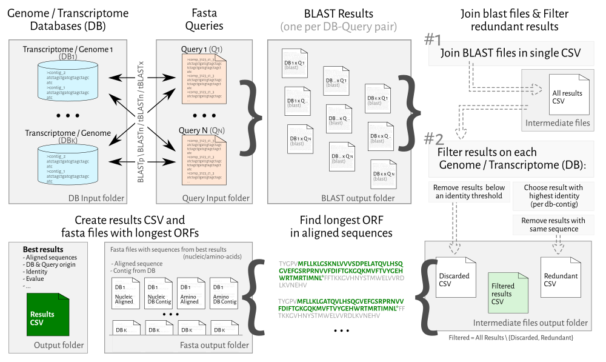

MassBLAST
==========

[Official site](https://averissimo.github.io/mass-blast)

Command line application to perform BLAST queries from multiple files against different databases at once.

**We recommend using a packaged release of MassBlast available [at this link](https://github.com/averissimo/mass-blast/releases/latest)**. The only requirement is to have BLAST+ installed. See all the information in the section below.

The latest release can be [downloaded here](https://github.com/averissimo/mass-blast/releases/latest).

A pre-print of the manuscript describing this application is available at bioRxiv and can be [accessed here](https://www.biorxiv.org/content/early/2017/07/03/131953).

*General description of the MassBlast workflow:*

[](docs/pipeline.png)

## Install

1. Download BLAST+ and MassBlast from the links in the table below
1. BLAST+ must be installed and available from a command line
    - *check by running the command:* `blastn -version`
1. Decompress MassBlast and it is ready to be used using the `mass-blast` script

MassBlast *downloads* | [Windows]({{ site.windows_url }}) | [Mac OS X]({{ site.mac_url }}) | [Linux]({{ site.linux_url }})
BLAST+ (pre-requirement)| [v2.2.30 (32-bit)](ftp://ftp.ncbi.nlm.nih.gov/blast/executables/blast+/2.2.30/ncbi-blast-2.2.30+-win32.exe) | [v2.6.0](ftp://ftp.ncbi.nlm.nih.gov/blast/executables/blast+/2.6.0/ncbi-blast-2.6.0+-x64-macosx.tar.gz) | [2.6.0](ftp://ftp.ncbi.nlm.nih.gov/blast/executables/blast+/2.6.0/ncbi-blast-2.6.0+-x64-linux.tar.gz) |

*BLAST+ important notes*

1. Must be installed before MassBlast is run
1. *Windows users*
    1. Must install [*32-bit* version *v2.2.30* of BLAST+](ftp://ftp.ncbi.nlm.nih.gov/blast/executables/blast+/2.2.30/ncbi-blast-2.2.30+-win32.exe)
    1. In case of an error in the first run:
        - Delete `ncbi.ini` located at a subdirectory at the `AppData` folder in the user directory
        - If problem persists, [submit an issue](https://github.com/averissimo/mass-blast/issues).
1. *Mac OS X* and *Linux users*
    - MassBlast was tested with version 2.6.0, but it could work with more recent versions *(or older and down to v2.2.30)*

*note:* Ruby and all other requirements are included in the package files, it is not necessary to install *when using packaged version*.

### How to use MassBlast?

- Place fasta files with queries at `db_and_queries/queries` folder.
  - You can have as many files as needed, see below for an example of a nucleotide query
- Place blast databases at `db_and_queries/db` folder.
  - Check "How to setup a Blast database for a transcriptome" below for more information on creating a Blast database.
- Edit user.yml file to change options and BLAST engine to be used, check `user.yml.example` for more information.
- run mass-blast script *(either double click it on Windows or as a command in the command line.*

Example of a nucleotide query file that could be placed in `db_and_queries/queries` folder:

```
>Example01
attgggaatttactgcaactcaaggagaagaaaccctaccagacttttacaaggtgggct
gaggagt
>Example03
attgggaatttactgcaactcaaggagaagaaaccctaccagactttt
>Example02
attgggaatttactgcaactcaaggagaagaaaccctaccagacttttacaaggtgggct
gaggagtatttactgcaactcaaggagaagaaaccctaccagacttttacaaggtggtgg
gcaactcaagcaactcaagcaactcaagcaactcaa
```

## Install and usage (from source code)

We do not recommend installing from source unless you plan to develop MassBlast further. The package available already has all dependencies pre-packaged and is ready to be used.

Requirements:
- Ruby interpreter
- Bundler gem
- rub `bundle install` at root directory
- Options are configurable via `config/user.yml` file
  - Change 'db_parent' and 'query_parent' to specify the parent directories for blast databases and queries
  - Change 'dbs' and 'folder_queries' to specify the databases that should be used and which query folders should be crawled

  $ ruby script.rb

### External data

The test blast database and the taxonomy database are not kept in the git tree anymore, to get this auxiliary data run the command below or call mass-blast via script.rb

    $ rake bootstrap.rb

If you need to include it on your code use:

    require_relative 'src/download'

    ExternalData.download(path_to_db_parent)

### How to test it

    $  rake spec

### Type of BLAST methods available

The method is defined in the file `user.yml`

- BLASTn: Nucleic-acid sequences against a nucleic-acid database
- TBLASTn: Protein sequences against a nucleic-acid database (dynamically translated to amino-acid sequences in all six reading frames)
- TBLASTx: Nucleic-acid sequences against nucleic-acid database, where both query and database are dynamically translated to amino-acid sequences into all six reading frames

### Methods available

All different types have two implemented methods, blast and blast_folders

- blast(qfile, db, out_file, query_parent=nil, db_parent=nil)
  - *qfile*: query file path - string
  - *db*: database name - string
  - *out_file*: output file path (can be relative) -string
  - *query_parent*: parent directory of query (optional) - string
  - *db_parent*: parent directory of database (optional) - string

*notes:* '*qfile*' and '*db*' arguments can be relative to '*query_parent*' and '*db_parent*' (respectively).

- blast_folders( folders=nil, query_parent=nil, db_parent=nil )
  - *folders*: list of folders (optional) - array of strings
  - *query_parent*: parent directory of folders (optional) - string
  - *db_parent*: parent directory of database (optional) - string

*notes:* '*folder*' argument can be relative to '*query_parent*'. All optional parameters must be set in the config.yml file

### How to setup a Blast database for a transcriptome

Using makeblastdb command that comes bundled with Blast+

- Open the command line in your operating system
- Navigate to directory
- Go to directory that has the fasta file with the assembly
- Run makeblastdb command in that directory

  - nucleotides database

    $ makeblastdb -in &lt;filename&gt; -dbtype nucl -out "&lt;blast_db_new_name&gt;" -title "&lt;blast_db_new_name&gt;"

  - protein database

    $ makeblastdb -in &lt;filename&gt; -dbtype nucl -out "&lt;blast_db_new_name&gt;" -title "&lt;blast_db_new_name&gt;"

*note:* do to not use spaces in the &lt;blast db new name&gt;

#### Quickly setup databases

Place the fasta files for the database in db_and_queries/import_dbs directory and run the appropriate script.

You also need to say if it is a nucleotide or protein-based fasta file.

For Linux and Mac OS X run the `import_fastas.sh` script

    $ cd db_and_queries/import_dbs
    # for nucleotide
    $ sh import_fastas.sh nucl
    # for protein
    $ sh import_fastas.sh prot

For Windows run the `import_fastas.bat` script

    $ cd db_and_queries/import_dbs
    # for nucleotide
    $ import_fastas.bat nucl
    # for protein
    $ import_fastas.bat prot

### Related Tools

- [ORF-Finder](http://github.com/averissimo/orf_finder): Finds the longest Open Reading Frame from a nucleotide sequence
- [BioRuby](http://bioruby.org/): Open source bioinformatics library for Ruby
- [Gene Extractor](https://github.com/averissimo/gene-extractor/): can be used to extract genes from Kegg2 and GenBank using keyword search
- [MassBlast package bundler](https://github.com/averissimo/app-mass-blast): Creates a package that can be easily used in all main Operating Systems without having to install Ruby and any Ruby dependecies

## Ackowledgements

MassBlast was developed primarily by *[André Veríssimo](http://web.tecnico.ulisboa.pt/andre.verissimo/)*, *Jean-Etienne Bassard* and *[Susana Vinga](http://web.tecnico.ulisboa.pt/susanavinga/)*

A pre-print of the manuscript is available at bioRxiv and can be [accessed here](https://www.biorxiv.org/content/early/2017/07/03/131953)

This work was supported by:

- European Union Framework Program 7, Project [BacHBERRY](www.bachberry.eu) *(FP7-613793)*;
- [FCT](www.fct.pt), through IDMEC, under LAETA, projects *(UID/EMS/50022/2013)*;
  - Susana Vinga acknowledges support by program
 Investigador FCT *(IF/00653/2012)* from [FCT](www.fct.pt), co-funded by the European Social Fund *(ESF)* through the Operational Program Human Potential *(POPH)*;
  - André Veríssimo acknowledges support from [FCT](www.fct.pt) *(SFRH/BD/97415/2013)*.

We would like to thank *Cathie Martin* and *Philippe Vain* for reading the manuscript and providing us
with important comments and insights. We would also like to thank *Aldo Ricardo Almeida Robles* and *Nuno Mira* for testing MassBlast.
